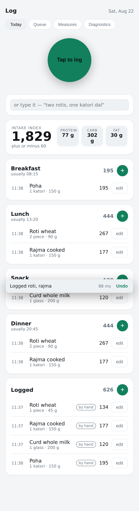
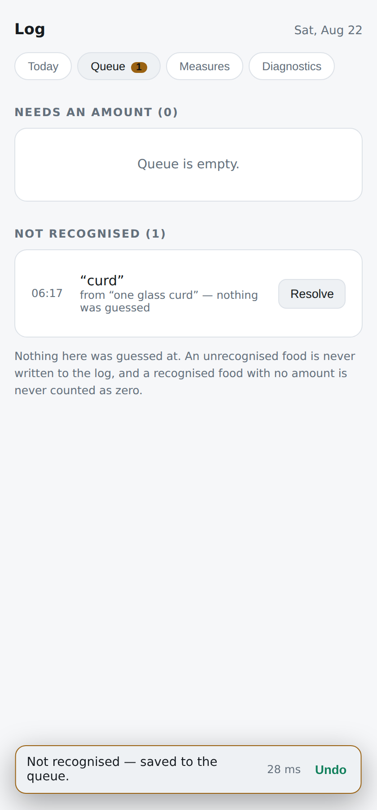
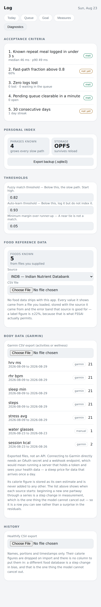

# Nutrition log — v0

Speak a meal, it's logged. The app learns your food vocabulary, resolves
household measures against your own calibration, and reports an intake
index with an honest error bar instead of a confident calorie count.

Built to the spec in [`docs/BUILD_BRIEF.md`](docs/BUILD_BRIEF.md). The
single hypothesis under test: **can a meal be logged by voice faster than
it can be typed, and will that keep happening for 30 days?**

📚 **[Full documentation](docs/)** —
[functional spec](docs/FUNCTIONAL_SPEC.md) ·
[architecture](docs/ARCHITECTURE.md) ·
[schema](docs/SCHEMA.md) ·
[technical spec](docs/TECHNICAL_SPEC.md)

| Today | Queue | Diagnostics |
|---|---|---|
|  |  |  |

---

## Running it

```sh
npm install
npm run dev            # http://localhost:5173
npm run build          # typecheck + production build
npm test               # unit tests, run under both UTC and IST
npm run test:browser   # end-to-end checks in Chromium, incl. OPFS persistence and CSP
```

Then, in the app under **Diagnostics**:

1. Load a food CSV (see *Food data* below). Nothing ships with the app.
2. Optionally import a Healthify export.
3. Under **Measures**, weigh one katori, one piece, one glass. Once.

Add it to your phone's home screen and it runs standalone.

### CLI

```sh
npm run load-indb -- data/indb.csv                  # food reference data
npm run load-indb -- data/labels.csv --source label # anything with its own provenance
npm run import-healthify -- exports/healthify.csv   # names, portions, timestamps only
npm run nightly                                     # recompute daily_logging_stats
npm run diagnostics                                 # acceptance criteria, measured
```

The CLI writes to `data/nutrition.sqlite3` (gitignored). Override with
`LOG_DB=path`.

---

## Deploying

The app is a folder of static files. It has no server, no database, no
environment secret and nothing to leak — every byte of personal data lives
in the visitor's own browser. What hosting buys is **HTTPS**, and that is
not cosmetic: Web Speech and OPFS both require a secure context, so the
mic and persistence simply do not work from a plain `http://` LAN address.

`render.yaml` in the repo root is a Render Blueprint. On Render:
**New → Blueprint → connect this repo → Apply**. It picks up the build
command, publish directory, cache policy and security headers from that
file; there is nothing to fill in and no secrets to add.

### Static Site, not Web Service

Pick **Static Site**. A free-tier *web service* sleeps after ~15 minutes
idle and cold-starts in roughly 50 seconds — a poor match for an app whose
entire claim is "logged in under three seconds". A static site is free,
CDN-backed and never sleeps. Render cannot convert one type into the
other, so a service created as the wrong type has to be recreated.

Or configure it by hand — any static host works the same way:

| | |
|---|---|
| Build command | `npm ci --include=dev && npm run build` |
| Publish directory | `dist` |
| Rewrites | none — the app has no client-side router |

`--include=dev` is deliberate: hosts set `NODE_ENV=production`, which
makes npm skip devDependencies, and `vite` and `typescript` live there.

Verify the built output before trusting a deploy:

```sh
npm run test:hosted   # serves dist/ from a dumb static server, runs the
                      # full browser suite against it, checks the SW
```

That serves `dist/` with nothing but a MIME table — no rewrites, no dev
conveniences — because `vite preview` is friendlier than a real host and
will hide problems a static host would not.

### Containers

`Dockerfile` builds the app and serves `dist/` through nginx with the same
headers `render.yaml` sets — for a container host, a home NAS, or a Render
*web service* if you already made one. It is the fallback, not the
recommendation, for the cold-start reason above.

```sh
docker build -t nutrition-log . && docker run -p 8080:10000 nutrition-log
```

The container listens on `$PORT` (default 10000), which is what Render
injects. All response headers live in the `server` block of
`docker/nginx.conf.template` and nowhere else: in nginx an `add_header`
inside a `location` *replaces* the inherited set instead of adding to it,
so a per-location `Cache-Control` would silently drop the CSP and
`X-Frame-Options` from the HTML page. Cache-Control is varied through a
`map` for that reason.

> Built and served, but **not** exercised end-to-end in CI — there is no
> Docker daemon in the environment this was developed in. The nginx config
> and the port substitution are verified; the image build is not.

Two headers in `render.yaml` are load-bearing rather than decorative:
`/assets/*` is `immutable` (Vite content-hashes those names, so it is safe
and it is what makes repeat loads instant), and `sw.js` is `no-cache` — a
cached service worker is a site that can never update itself again.

---

## Stack, and why

A **mobile PWA**: Web Speech API for STT, SQLite compiled to WASM with
OPFS persistence, plain TypeScript, no framework. This is what the brief
recommended and nothing came up to justify deviating — it tests the
hypothesis in days and installs to a phone with no store listing.

**SQLite runs in a dedicated worker.** This is the one structural thing
that isn't obvious from the brief, and it isn't a preference. OPFS
*synchronous access handles* — the only way to get durable local SQLite
without asking the host to send COOP/COEP headers — do not exist on the
main thread in any current browser. A main-thread database opens fine,
logs fine, and then loses the day on reload. Everything in `src/core/`
stays synchronous inside that worker, so the capture write still never
yields; only the UI's view of it is a promise.

If Web Speech latency proves unacceptable on Android, the fallback named
in the brief is React Native + Expo with on-device recognition. Nothing
outside `src/app/speech.ts` would change: the core takes a string.

```
src/core/       pure logic, no DOM, no browser — this is what the tests cover
src/platform/   two Db implementations: node:sqlite (tests, CLI), sqlite-wasm (app)
src/worker/     the database worker — owns the connection, runs the core
src/app/        UI: async proxy to the worker, views, mic, toast
db/             schema.sql (given, plus additive v0 tables) and seed.sql
```

---

## What v0 does

- [x] Voice capture → on-device STT → raw utterance persisted before anything else
- [x] Deterministic local parser — **no model call on the fast path**
- [x] Fuzzy match against `phrase_index`, your own index
- [x] Fast path: match → grams → write → toast. No confirmation screen
- [x] Slow path: unmatched food → resolve by hand → written back, fast forever after
- [x] Pending-quantity queue, clearable in one pass
- [x] Undo toast, 5 s, non-blocking
- [x] Manual edit of any entry, via `log_revision`
- [x] Unit calibration screen — weigh once, store grams, re-derive past entries
- [x] Healthify import — names, portions, timestamps; **no calorie figures**
- [x] Daily totals with error bars combined in quadrature
- [x] `daily_logging_stats` populated nightly
- [x] `match_score` logged on every entry from day one, plus a full `match_audit`

**Not built, by design:** Garmin ingestion, the adaptive TDEE model, goals
and targets, the exercise logger, micronutrient UI, any recommendation
engine. The schema accommodates all of them — `workout_session`,
`session_energy` and the precedence view are already there, unused — so
none of it needs a migration.

---

## The design principles, and where they live in the code

Each of these has tests that fail if it is broken.

**1. Consistency beats accuracy.** Normalisation is stable above all else
(`normalise` in `parse.ts`); `daily_logging_stats` records *how* each day
was logged, not just what, so a change of regime is visible before it
corrupts a regression.

**2. Capture never blocks.** `capture()` writes the utterance outside the
resolution transaction. A parse failure, a match failure, a thrown error
downstream — none of them can roll it back.

**3. Ambiguous ≠ incomplete.** An unrecognised food never reaches
`log_entry`. A recognised food with no quantity does, as
`pending_quantity`. `parse()` returns *nothing* for "two katoris" — a unit
with no food is ambiguity, not a gap.

**4. Pending entries are excluded, never zeroed.** `v_daily_totals`
filters on `status = 'resolved'`, and the UI says the day is incomplete
rather than showing a number that looks finished.

**5. Every number carries provenance.** No nutrient value appears in any
source file. Everything comes through `foodimport.ts` from a file you
supplied, with its `source` and a `rel_error` — 22% for a label, because
that is what FSSAI tolerance actually permits.

**6. Edits are append-only.** `revise()` writes a `log_revision` row for
every change. Recalibrating a measure writes one *per affected entry*.

**7. Household measures resolve against your calibration.** `toGrams()`
prefers a food-specific measure, then a general one, and returns `null`
rather than inventing grams for a measure you have never weighed.

**8. Default permissive, surface consequences, never block.** Every
threshold is editable in the app. Nothing is locked, nothing nags.

**9. Store every estimate, sum none of them.** `session_energy` holds one
row per source; `v_session_energy` emits exactly one row per session.
Double-counting is structurally impossible, not merely discouraged.

---

## Three decisions worth your sign-off

The brief says not to "improve" the design without asking. These are the
three places I made a call. All three are reversible; two are settings.

**1. Auto-learn is gated above the match threshold.**
The reference `resolve.py` writes back to `phrase_index` on every accepted
match, including a fuzzy one that just cleared 0.82. That makes a marginal
match permanent: next time it is an *exact* hit at score 1.0, and the
false positive compounds silently — the exact failure mode the brief says
you will never catch. So there are now two thresholds:
`fuzzy_threshold` (0.82) decides whether to log it, `auto_learn_threshold`
(0.93) decides whether to *remember* it. Below the second, the entry lands
and shows a `~0.86` pill in the day list, and the decision is in
`v_match_review` for you to accept or not. Set `auto_learn_threshold` to
`fuzzy_threshold` to get the original behaviour.

**2. A fuzzy win must beat its runner-up by a margin** (`min_match_margin`,
0.05). "paneer bhurjee" scoring 0.88 against *both* "paneer bhurji" and
"paneer burji" is a coin flip wearing a confident number. Set to 0 to
disable.

**3. Imported Healthify rows never become `log_entry` rows.**
They land in `imported_entry`, which has no nutrient column at all. The
brief says the history is "for pattern seeding, not for numbers", and this
is the most literal reading: the history seeds `phrase_index` candidates
and derives your meal-slot windows, and nothing else. If you would rather
have the six months in the log itself, that is a different call and it
changes what days are model-eligible.

Also worth flagging: `phraseCandidates()` **suggests** but never binds.
Attaching a name from someone else's database to a food is a food-identity
decision, and those are never made automatically.

---

## Fixes to the reference implementation

Found while porting `resolve.py` and covered by tests:

- **`UNIQUE (food_id, unit_id)` cannot dedupe the general calibration.**
  SQLite treats NULLs as distinct inside a UNIQUE constraint, so
  recalibrating "a katori" appended a second row and every lookup kept
  returning the stale grams — a household measure that silently refuses to
  move. Fixed with a partial unique index on `unit_id WHERE food_id IS NULL`.
- **`revise()` tripped its own CHECK constraint.** Clearing a quantity on a
  row still marked `resolved` violates the resolved-rows-are-complete
  invariant mid-statement, even though the end state is legal. It now drops
  to pending first.
- **An utterance that parsed to nothing was marked processed.** `"mmm"`
  set `processed_at` with no entries and no queue position — a silently
  lost log, against acceptance criterion 3. `processed_at` is now set only
  when every parsed item landed.
- **`revise()` interpolated the field name into SQL.** Now whitelisted.
- **`-is$` ate the plurals that matter most.** A guard meant for "basis"
  was turning "rotis" into "rotis" instead of "roti" — the very first
  phrase the brief names. Now an explicit list.
- **Meal-slot k-means merged a real snack into lunch and split dinner.**
  Quantile seeding puts two centres inside whichever occasion you log most.
  Replaced with exact 1-D dynamic programming, which is cheap at this size
  and gives the same windows for the same data every time.

Found in a second review pass, also tested:

- **Timestamps were stored as UTC.** The schema says "ISO8601, device
  local" and every downstream consumer — `date(eaten_at)` day grouping,
  the streak count, meal-slot windows — assumes it. Stored as UTC, an IST
  dinner logged at 00:30 landed on yesterday. Everything now goes through
  `localIso()`, and the test suite runs twice (`TZ=UTC` and
  `TZ=Asia/Kolkata`) with an explicit midnight-boundary regression test.
- **Completing an entry erased how it was matched.** Supplying a missing
  amount rewrote `match_method` to `'manual'`, so a fast-path entry
  stopped counting toward `fastpath_fraction` — quietly corrupting
  acceptance criterion 2. Only a food-identity change is a re-match now.
- **`weighed_fraction` double-counted entries.** A LEFT JOIN onto
  `user_measure` fans out when a unit has both a general and a
  food-specific calibration; the fraction now reads the basis of the one
  measure that actually resolved the entry.
- **Re-importing a Healthify export duplicated portion-less rows.** The
  same NULLs-are-distinct trap as the calibration table, one table over.
  Deduped through a `COALESCE` expression index (applied as a migration in
  `seed.sql`, which runs on every open).
- **A two-item slow-path utterance could only ever resolve its first
  item.** The queue is now one row per unmatched *phrase*, and the
  utterance closes only when the last phrase is settled.
- **Re-teaching a phrase kept the old food.** `learn()`'s upsert ignored
  the caller's food on conflict, so a manual correction was silently
  discarded and the index repeated the mistake forever.

### Security hardening

- `npm audit` clean (vitest 2→4 removed a critical advisory chain).
- A build-time CSP (`default-src 'self'`, no inline script or style) on a
  page that holds months of personal health data — defence in depth; the
  code has no HTML-injection sinks and makes no cross-origin requests.
- The service worker is network-first for navigations: the old cache-first
  shell could never deliver an update after a redeploy.
- `%`/`_` are escaped in food search, so LIKE input is literal.
- Malformed dates in a Healthify export are skipped, never guessed onto a
  day — day boundaries are model input.
- **Export backup** (Diagnostics) downloads the whole database as one
  `.sqlite3` file; OPFS lives in a single browser profile, and months of
  logs with no copy anywhere else would be its own data-loss bug.

---

## Food data

**None ships with this repository, and `data/` is gitignored.**

- **INDB** (Indian Nutrient Databank) is the intended primary source: open
  access, ~1,095 items plus ~1,014 recipes with ingredient decomposition.
- **IFCT 2017** is reference only. It is personal-use licensed — load it
  locally if you want it, but nothing derived from it may be committed.

The loader takes any CSV with a food-name column and at least one
recognised nutrient column, and records which source you told it the file
came from. A blank cell is treated as missing, never as zero.

---

## Tuning

`FUZZY_THRESHOLD` was a placeholder in the brief and it still is. It lives
in `app_setting`, editable in the app, because a placeholder you have to
redeploy to change never gets tuned.

When there is real data, `v_match_review` orders every fuzzy decision by
how close it came to the threshold — accepted and rejected both, with the
runner-up it beat and by how much. Tune from that, not from vibes.

`fuzzy_lookup` is a full scan with a difflib-compatible ratio. Fine at a
few hundred phrases. `bestMatch()` in `similarity.ts` is the interface to
keep when it stops being fine.
