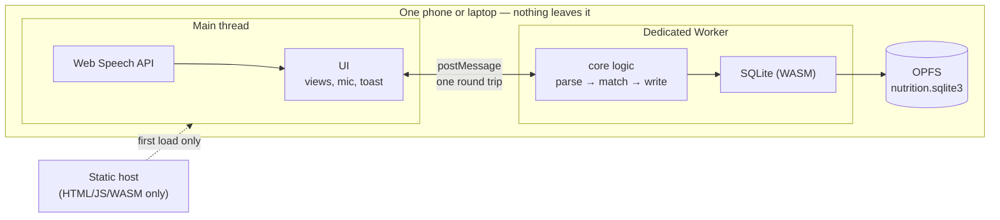
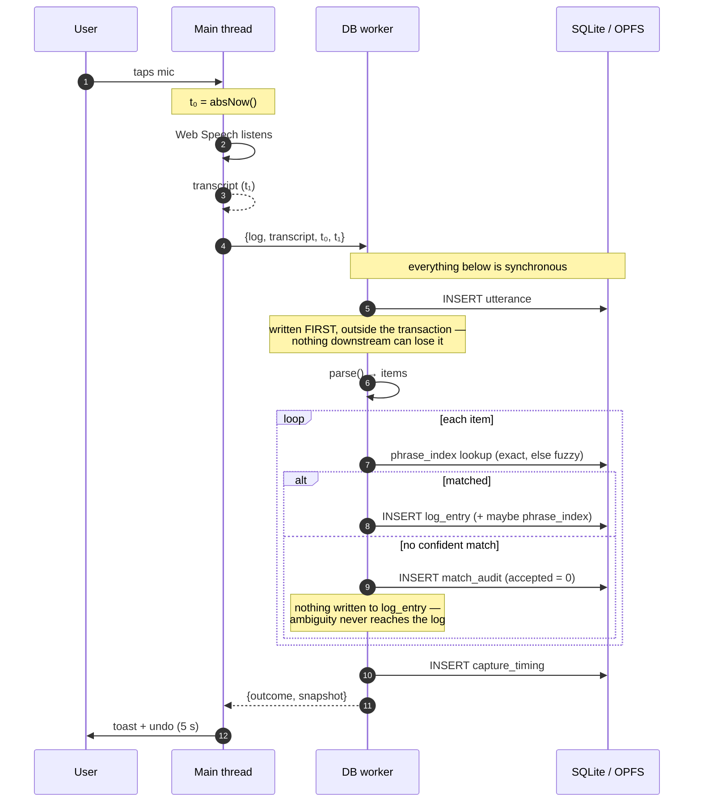
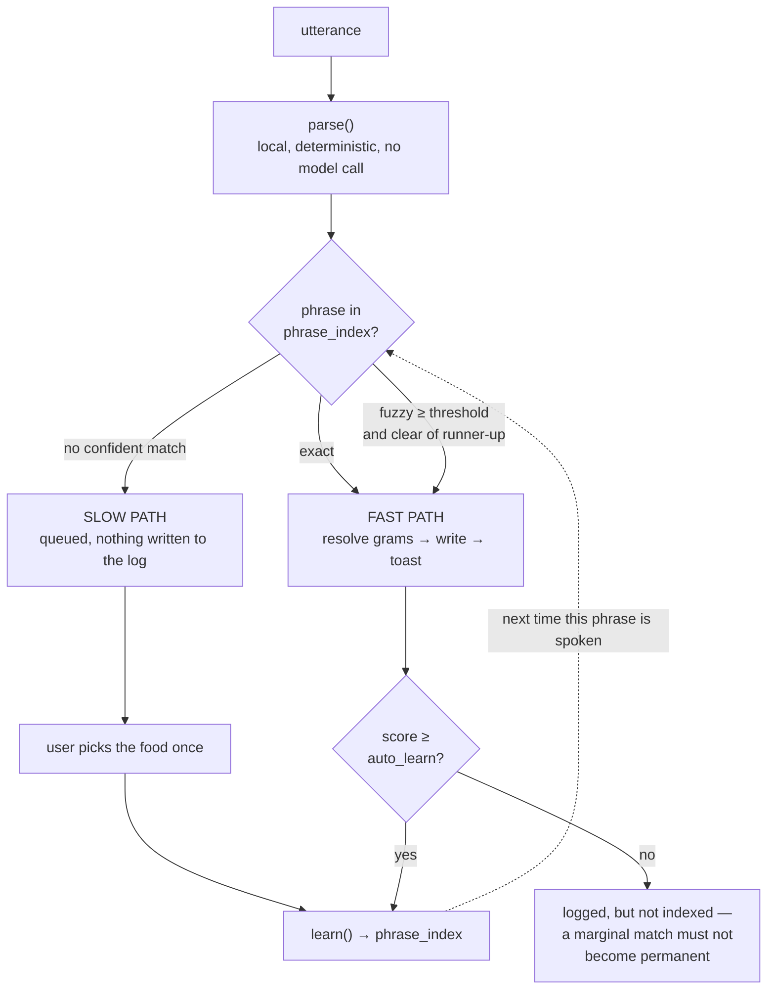

# Architecture

> A personal nutrition log. Speak a meal, it is logged. Everything runs on
> one device, in one browser, with no server and no account.

This document explains **how the system is put together and why**. For what
it does, see [FUNCTIONAL_SPEC.md](FUNCTIONAL_SPEC.md). For how each
algorithm works, see [TECHNICAL_SPEC.md](TECHNICAL_SPEC.md). For the data
model, see [SCHEMA.md](SCHEMA.md).

---

## 1. The shape of the thing

There is no backend. The entire application is a folder of static files;
the "database server" is SQLite compiled to WebAssembly, running inside the
user's own browser, persisting to that browser's origin-private filesystem
(OPFS).



The static host serves code and never sees data. There is no API to call,
no token to leak, no row that belongs to anyone else. This is not a
privacy feature bolted on; it is the cheapest way to build the product,
and the privacy follows for free.

---

## 2. Layers, and the rule that keeps them honest

```
src/core/       pure logic. No DOM, no browser API, no I/O except a Db handle.
src/platform/   two Db implementations: node:sqlite and sqlite-wasm.
src/worker/     the database worker. Owns the connection, runs the core.
src/app/        UI. Talks to the worker; never touches SQL.
db/             schema.sql and seed.sql — the source of truth for the data model.
```

**The rule: dependencies point downward only.** `core` may not import from
`app`, `worker`, or `platform`. This is what makes the interesting code
testable — the parser and the resolver run in Node against `node:sqlite`,
with no browser and no mocking, which is why there are ~105 fast unit
tests instead of a handful of slow end-to-end ones.

```mermaid
flowchart TD
  app["src/app — UI"] --> worker["src/worker — db-worker"]
  worker --> core["src/core — pure logic"]
  worker --> browserdb["src/platform/browser-db<br/>sqlite-wasm + OPFS"]
  tests["tests/ + scripts/"] --> core
  tests --> nodedb["src/platform/node-db<br/>node:sqlite"]
  core --> dbi["core/db.ts — the Db interface"]
  browserdb -.implements.-> dbi
  nodedb -.implements.-> dbi
```



`core/db.ts` is deliberately tiny — `exec`, `all`, `get`, `run`, `tx`,
`close`. Everything the core needs and nothing more, so a second
implementation is a hundred lines rather than a project.

---

## 3. Why SQLite runs in a worker

This is the one structural decision that is not obvious, so it is worth
stating plainly:

> **OPFS synchronous access handles do not exist on the main thread in any
> current browser.**

`createSyncAccessHandle()` — the API that lets SQLite do real, durable,
synchronous file I/O — is Worker-only. A main-thread SQLite build opens
fine, logs fine, and then **loses everything on reload**, which is the
worst possible failure mode: it looks like it works.

The alternative is the non-pooled OPFS VFS, which needs `SharedArrayBuffer`
and therefore COOP/COEP response headers, which in turn requires control
over the host and breaks cross-origin resources. That trades "runs on any
static host" for nothing we need.

So: the worker owns the connection, and uses the `opfs-sahpool` VFS, which
needs no special headers. Verified end to end in
`tests/browser/hosted.mjs` — an entry survives a reload from a plain
static server.

**What the worker boundary costs, and what it does not.** It does *not*
cost the design principle "capture never blocks": inside the worker, the
whole capture path is synchronous and uninterruptible, exactly as intended.
It costs one `postMessage` hop, measured in the capture timing like
everything else.

---

## 4. The capture path

The path that matters. Everything else in the app is in service of these
few hundred milliseconds.



Two things about this diagram are load-bearing:

1. **The utterance is committed before parsing begins**, outside the
   resolution transaction. A crash, a thrown error, an unparseable
   sentence — the raw words survive.
2. **There is no confirmation step.** The entry is already in the database
   when the toast appears. The toast offers a window to revoke, not a
   prompt to approve. A confirm dialog is the single most common reason
   food logging stops happening.

---

## 5. The snapshot protocol

The worker exposes a small typed RPC (`src/app/protocol.ts`). Every
mutation returns a **complete new snapshot** of everything the UI draws.

```ts
interface Snapshot {
  date; totals; entries; pending; orphanItems;
  units; diagnostics; settings; indexSize; foodCount; persistent;
}
```

Why a single fat payload rather than granular queries:

- **One hop per user action.** The capture path stays at exactly one
  round trip.
- **The UI renders synchronously** from a plain object, so views are
  ordinary functions with no async in them.
- **No torn reads.** A view is never assembled from two different moments,
  which is what you get when six independent queries race.

The main-thread `Store` is a thin promise-based proxy: it posts a request,
resolves the matching reply by id, and keeps the latest snapshot.

---

## 6. Two clocks

Time appears twice and the two uses must not be confused.

| Concern | Function | Why |
|---|---|---|
| **Measuring the capture** | `absNow()` = `performance.timeOrigin + performance.now()` | `performance.now()` is relative to *each context's own* origin. A mic tap timed on the main thread and a commit timed in the worker are not comparable without adding `timeOrigin`. |
| **Storing when you ate** | `localIso()` — local wall time, no zone suffix | The schema says *"ISO8601, device local"*, and every consumer assumes it: `date(eaten_at)` day grouping, the streak count, meal-slot windows. |

The second one was a real bug. Stored as UTC, an IST dinner logged at
00:30 landed on **yesterday** — feeding wrong day boundaries straight into
the model the whole design exists to protect. The unit suite now runs
twice, under `TZ=UTC` and `TZ=Asia/Kolkata`, with an explicit
midnight-boundary regression test.

---

## 7. Fast path and slow path

The product thesis in one diagram: the app gets faster the longer it is
used, because the slow path feeds the fast one.



A generic food database cannot do this: it does not know that *you* say
"rajma" and mean your mother's recipe at 150 g a katori.

---

## 8. Where each design principle lives

The brief lists nine non-negotiable principles. Each one is enforced in
code, and each has tests that fail if it is broken.

| # | Principle | Enforced by |
|---|---|---|
| 1 | Consistency beats accuracy | `normalise()` stability; `daily_logging_stats` records *how* a day was logged |
| 2 | Capture never blocks | `capture()` writes outside the resolution transaction |
| 3 | Ambiguous ≠ incomplete | `matchItem()` returns `null` rather than guessing; `pending_quantity` status |
| 4 | Pending excluded, never zeroed | `v_daily_totals` filters `status = 'resolved'`; UI states the day is incomplete |
| 5 | Every number carries provenance | `food.source` + `food_nutrient.rel_error`; no nutrient literal in any source file |
| 6 | Edits are append-only | `revise()` and `recalibrate()` write `log_revision` rows |
| 7 | Household measures are yours | `toGrams()` → `user_measure`, returns `null` rather than inventing grams |
| 8 | Default permissive, never block | thresholds live in `app_setting`, editable in the app |
| 9 | Store every estimate, sum none | `session_energy` rows + `v_session_energy` read-time precedence |

---

## 9. Testing strategy

Three tiers, each testing what only it can:

| Tier | Command | Covers |
|---|---|---|
| **Unit** (~105) | `npm test` | All of `src/core` against `node:sqlite`. Run **twice**, `TZ=UTC` and `TZ=Asia/Kolkata`. |
| **Browser** (13) | `npm run test:browser` | sqlite-wasm, OPFS persistence across reload, the real UI, CSP, backup bytes. |
| **Hosted** | `npm run test:hosted` | The built `dist/` served by a dumb static server — no rewrites, MIME table only — plus service-worker registration. |

The third tier exists because `vite preview` is friendlier than a real host
and will hide problems a static host would not.

---

## 10. What is deliberately absent

The schema accommodates these so none needs a migration; the app
implements none of them:

- Garmin *API* sync. File import of Garmin exports **is** built
  (`src/core/garmin.ts`); live OAuth sync is not, and would require a
  server holding a token — see TECHNICAL_SPEC §13
- The adaptive TDEE model, goals, calorie targets
- The exercise logger (`workout_session` / `session_energy` exist, unused)
- Micronutrient UI
- Any recommendation engine
- Accounts, sync, multi-device, analytics, subscriptions

v0 tests exactly one hypothesis: *can a meal be logged by voice faster
than it can be typed, and will that keep happening for 30 days?* Anything
that does not serve that question is scope creep.
