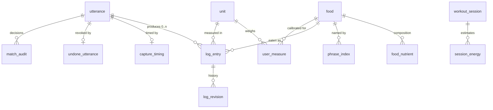
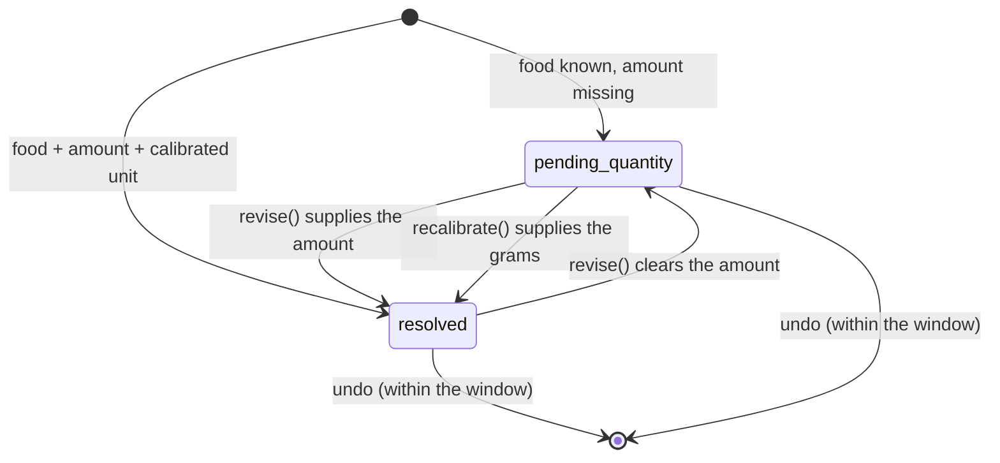

# Data model

SQLite. The authoritative definition is [`db/schema.sql`](../db/schema.sql);
this document explains **what each table is for and which invariant it
defends**. Seed data and additive migrations live in
[`db/seed.sql`](../db/seed.sql), which runs on every open and is idempotent.

Sections 1–8 are the schema as given in the build brief, unchanged.
Sections 9–16 are additive v0 work.

---

## Map



Two tables sit outside that graph on purpose: `imported_entry` (history
from another app — see §12) and `daily_logging_stats` (§7).

---

## 1. `utterance` — raw capture

Written the instant speech-to-text returns, before parsing, before
matching, before anything that can fail.

| Column | Notes |
|---|---|
| `spoken_at` | ISO-8601, **device local wall time**, no zone suffix |
| `tz_offset_min` | the offset in force at that instant, stored beside it |
| `raw_text` | exactly what STT returned. `CHECK (raw_text <> '')` |
| `stt_confidence` | 0..1, null if the engine did not supply one |
| `processed_at` | **null = still visibly queued** |

`processed_at` is the "zero logs lost" mechanism. It is set **only** when
every parsed item produced a `log_entry`. An utterance that parsed to
nothing, or that had one item fall to the slow path, keeps `NULL` and
stays visible in `v_orphan_utterance`.

> Why local time: `date(eaten_at)` grouping, the streak count and meal-slot
> windows are all wall-clock questions. Stored as UTC, an IST log at 00:30
> lands on the previous day.

## 2. `food`, `food_nutrient` — reference data with provenance

Composition is **per 100 g edible portion**, always.

| `food` column | Notes |
|---|---|
| `source` | `indb` \| `ifct2017` \| `usda_fdc` \| `label` \| `user_defined` |
| `source_ref` | upstream row id / FDC id / GTIN |
| `source_fetched` | when that value was captured |
| `is_composite` | 1 = a dish built from a recipe |

| `food_nutrient` column | Notes |
|---|---|
| `nutrient` | canonical key: `kcal`, `protein_g`, `carb_g`, `fat_g`, `fibre_g`, … |
| `per_100g` | the value |
| `rel_error` | relative error band for this value |

**No nutrient value is ever written by application logic.** Every row
arrives through `loadFoods()` from a file the user supplied. `rel_error`
defaults by source — `0.10` for a database, **`0.22` for a label**, because
FSSAI permits ±20–25% tolerance on declared values and stored precision
must not exceed real precision.

## 3. `unit`, `food_unit`, `user_measure` — personal calibration

`unit.is_absolute = 1` means grams or millilitres: no conversion needed.
Everything else ("katori", "piece", "glass") is meaningless until pinned to
*your* version of it.

| `user_measure` column | Notes |
|---|---|
| `food_id` | **null = applies to all foods** |
| `grams` | what one of them weighs, for you |
| `basis` | `weighed` (put on a scale) \| `estimated` (guessed) |

Resolution precedence: food-specific first, then the general row, most
recently calibrated wins. If neither exists, `toGrams()` returns `null` —
the entry waits rather than inventing a number.

> **`UNIQUE (food_id, unit_id)` cannot enforce one general calibration per
> unit.** SQLite treats NULLs as distinct inside a UNIQUE constraint, so
> recalibrating "a katori" appended a second row and every lookup kept
> returning the stale grams. Fixed by the partial index
> `ux_user_measure_general ON user_measure (unit_id) WHERE food_id IS NULL`.
> This trap recurs — see `ux_imported_entry` and `ux_food_identity`.

## 4. `log_entry` — the log

| Column | Notes |
|---|---|
| `utterance_id` | null = typed, not spoken |
| `quantity`, `unit_id` | null while pending |
| `grams_resolved` | computed at resolution time |
| `status` | `resolved` \| `pending_quantity` \| `pending_food` |
| `match_method` | `exact_index` \| `fuzzy_index` \| `llm_resolved` \| `manual` |
| `match_score` | logged from day one, on every entry |



A **`CHECK` constraint enforces that a `resolved` row is complete** —
quantity, unit and grams all non-null. `pending_food` is in the enum for
completeness but must never occur: ambiguity is blocked upstream and never
reaches this table.

> `match_method` records how the **food identity** was decided, and
> `fastpath_fraction` is computed from it. Supplying a missing amount does
> not un-match the food, so only a `food_id` change rewrites it to
> `manual`.

## 5. `log_revision` — append-only history

Every change writes a row: `field`, `old_value`, `new_value`, `reason`
(`user_edit` / `quantity_supplied` / `recalibration`).

Editing a three-week-old entry in place silently rewrites the model's
training data with no record it happened. This table is what later
distinguishes a genuine metabolic shift from your own retroactive
correction. Recalibrating a measure writes one revision **per affected
entry**, not one for the measure.

## 6. `phrase_index` — the personal index

| Column | Notes |
|---|---|
| `phrase` | normalised: lowercase, no punctuation, singularised. `UNIQUE` |
| `food_id` | what you mean by it |
| `default_qty`, `default_unit_id` | so "rajma" alone can still resolve |
| `hit_count`, `last_used_at` | usage, and the inverse for undo |

This is the differentiator, and the thing a global food database
structurally cannot provide. It is also the only table where a wrong row
compounds: a bad binding becomes an *exact* match forever after. Hence the
separate `auto_learn_threshold` (§11).

## 7. `daily_logging_stats` — the bias-drift detector

Systematic error is fine if it is **stable** — a constant bias cancels out
of a TDEE regression. A *wandering* bias does not. So this table measures
not how accurate a day was but whether it was logged the **same way** as
the days around it.

| Column | Notes |
|---|---|
| `weighed_fraction` | share resolved via a `weighed` basis or an absolute unit |
| `fastpath_fraction` | share matched `exact_index` — acceptance criterion 2 |
| `outside_food_count` | branded foods; a run of restaurant meals is a regime change |
| `model_eligible` | **0 = do not feed this day to the regression** |

A day with any pending entry is `model_eligible = 0`. Under-logged by a
known amount is still under-logged.

## 8. Views

| View | Purpose |
|---|---|
| `v_daily_totals` | totals per nutrient. **Excludes pending entries**; errors combine in quadrature: `SQRT(SUM(POWER(value × rel_error, 2)))` |
| `v_pending_review` | the end-of-day queue |
| `v_model_excluded_days` | days that must not enter the fit |
| `v_entry_nutrient` | per-entry detail behind the totals |
| `v_orphan_utterance` | utterances with no outcome yet — must always be actionable |
| `v_match_review` | every fuzzy decision, ordered by closeness to the threshold |
| `v_session_energy` | exactly one row per workout session (§9) |

---

## 9. `workout_session`, `session_energy` *(designed-for; unused in v0)*

Every source that estimates session energy gets its **own row** —
`garmin`, `met_estimate`, `manual`. Precedence is a **read-time** decision
in `v_session_energy`, never a write-time constraint.

This is what makes double-counting *structurally impossible* rather than
merely discouraged: the view emits exactly one row per session, so no
`SUM` can ever pick up two estimates of the same workout.

## 9b. `daily_metric` — body data from Garmin

Sleep, REM, deep sleep, resting heart rate, HRV, stress, body battery,
steps. These are the reason to ingest Garmin at all; its calorie figure is
the least interesting number it produces.

Same shape as `session_energy`, for the same reason: one row per
**(day, metric, source)**, precedence resolved at read time in
`v_daily_metric`. Two devices disagreeing about last night's sleep is a
fact to store, not a conflict to settle at write time.

| Column | Notes |
|---|---|
| `log_date` | local calendar day |
| `metric` | `sleep_min`, `rem_min`, `deep_min`, `rhr_bpm`, `hrv_ms`, `stress_avg`, `body_battery_max`, `steps`, `water_glasses` |
| `source` | `garmin` \| `manual` (water is the only thing typed in by hand) |
| `value` | the measurement |

`v_daily_metric` emits exactly one row per (day, metric), preferring
`garmin` over `manual`.

`v_source_coverage` reports when each source starts and stops, across both
`daily_metric` and `session_energy`. Beginning to ingest a new source
partway through a series is a **step change in measurement regime** — the
one thing an adaptive TDEE regression cannot cancel. The model is not
built yet; this view exists so that when it is, the boundary is a row
someone can see rather than a discontinuity they must rediscover from the
residuals.

`ux_workout_session ON (started_at, COALESCE(kind, ''))` makes activity
import idempotent. `COALESCE` for the third time, for the third reason
(SCHEMA §3, §12): a NULL `kind` would otherwise defeat a plain UNIQUE and
duplicate every workout in a re-exported month.

## 9c. `body_profile`, `energy_target` — goal setting

> Owner-authorised addition. The brief listed goal setting as out of scope
> for v0; the owner has since put it in scope.

`body_profile` is **append-only**, like `log_revision` and for the same
reason: weight moves, and recomputing today's target from today's weight
must not silently rewrite what last month's target was. The newest row is
current; the older ones are how you got here, and `weightProgress()` reads
start and current straight off that history rather than keeping a separate
"start weight" that would eventually disagree with it.

| Column | Notes |
|---|---|
| `sex` | selects a formula coefficient set — a property of the published research, not a statement about people |
| `age_years`, `height_cm`, `weight_kg` | the formula inputs |
| `body_fat_pct` | null unless measured; Katch-McArdle is skipped without it |
| `activity_factor` | a plain number, so any preset can be overridden |
| `goal_rate_kg_per_week` | negative loses, positive gains, zero maintains |
| `goal_weight_kg` | null means a rate with no destination |

`energy_target` gives **every formula its own row**, exactly like
`session_energy`. Three published equations disagree by a couple of
hundred kcal on the same body; that disagreement is information, and
averaging it away would claim a precision none of them has.

| `source` | Meaning |
|---|---|
| `manual` | you set it by hand |
| `cycled` | the week's total, redistributed across its days (§9d) |
| `adaptive` | fitted to your own intake-vs-weight data (**not built**) |
| `mifflin` / `harris` / `katch` | population formulas |

`v_energy_target` emits exactly one row per day in that precedence order.

> **The precedence is inverted relative to `session_energy`, deliberately.**
> `session_energy` holds *measurements* of what happened, so the best
> instrument wins. `energy_target` holds *decisions* about what should
> happen, so the user's own decision wins — the brief's eighth principle
> is that this app does what it is told and explains the consequence,
> rather than the other way round.

## 9d. Calorie cycling

`planWeek()` redistributes a week's calories across its days using
`v_session_energy` (training load) and `v_daily_metric` (sleep, HRV,
stress), against **your own** rolling baselines rather than population
norms.

Two properties are not negotiable, and both are asserted by tests:

1. **The weekly total is conserved.** Cycling changes *when* the calories
   fall, never *how many*. The one exception is the safety floor, which
   may raise a day — and the caller is told it happened.
2. **Every number is explainable.** A transparent weighted sum with
   published weights and a per-day sentence naming which input moved it.
   An app whose thesis is "the number should be honest about where it came
   from" cannot then produce its most consequential number from a black
   box.

A missing metric contributes **nothing** — "the watch was on the charger"
is not "an average night". Setting `max_cycle_swing` to 0 disables cycling
entirely.

## 10. `capture_timing`

Acceptance criterion 1 says "under 3 seconds, **measured not estimated**".
A number nobody stored is an estimate.

`mic_tap_to_stt`, `stt_to_capture`, `capture_to_entry`, `total_ms`,
`fast_path`, `entry_count`. A separate table rather than columns on
`utterance`, because `utterance` is the one write on the critical path and
stays exactly as narrow as designed.

## 11. `app_setting`

Thresholds are placeholders, not tuned values — and a placeholder you must
redeploy to change never gets tuned. All are editable in the app.

| Key | Default | Meaning |
|---|---|---|
| `fuzzy_threshold` | `0.82` | below this → slow path |
| `auto_learn_threshold` | `0.93` | below this → log it, but do **not** index it |
| `min_match_margin` | `0.05` | a win this close to its runner-up is not a win |
| `undo_window_ms` | `5000` | how long the undo toast lives |
| `target_capture_ms` | `3000` | criterion 1's target |
| `macro_protein_pct` | `20` | macronutrient split, percent of energy |
| `macro_carb_pct` | `50` | the "balanced" preset commercial trackers ship |
| `macro_fat_pct` | `30` | a convention, not a finding — hence editable |
| `fibre_g_per_1000kcal` | `14` | fibre scales with intake, rather than being flat |
| `water_goal_glasses` | `8` | logged manually into `daily_metric` |
| `steps_goal` | `10000` | actuals come from the watch |
| `max_cycle_swing` | `0.2` | how far a day may move from flat. 0 disables cycling |

## 11b. `app_secret` — the sync credential

One row, one purpose: the bearer token the app presents to its sync
server.

**Separate from `app_setting` deliberately.** The snapshot the UI renders
from carries every setting; a credential has no business crossing that
boundary, and a test asserts it never appears there.

Kept in OPFS rather than `localStorage`, which is readable by any script
that ever runs on this origin. Under a strict CSP that should be a
distinction without a difference — but a credential is the wrong thing to
protect with only one layer.

## 12. `imported_entry` — Healthify history

Names, portions **as written**, and timestamps. There is deliberately **no
nutrient column to import into**: a different food database is a step
change in bias, and a step change in bias is the one thing an adaptive
TDEE model cannot cancel.

**Imported rows never become `log_entry` rows.** They seed `phrase_index`
*candidates* (never bindings — that is a food-identity decision) and derive
meal-slot windows.

> Idempotency uses `ux_imported_entry ON (source, eaten_at, food_text,
> COALESCE(portion_text, ''))`. A plain UNIQUE does not survive a NULL
> portion — the same trap as §3.

## 13. `meal_slot_window`

Derived by clustering when you actually log, never hard-coded. A nutrition
app that decides lunch is 12:00–14:00 is describing its own assumptions.
`derived_from` records whether the windows came from `imported_entry` or
your own `log_entry` rows.

## 14. `match_audit`

The only way you ever discover a false positive. Every fuzzy decision —
**accepted or rejected** — with the runner-up it beat, by how much, the
threshold in force at the time, and whether it was learned.

A false negative sends you to the slow path and corrects itself. A false
positive logs the wrong food silently and you never find out. This table
is the correction mechanism for the second kind.

## 15. `undone_utterance`

The undo toast replaces a confirmation step. The **utterance itself is
never deleted** — only the entries derived from it — so every utterance
still has exactly one outcome: entries, a queue position, or an undo.

## 16. Indexes worth knowing

| Index | Why |
|---|---|
| `idx_utterance_unprocessed` (partial) | the "still queued" scan |
| `idx_log_pending` (partial) | the end-of-day queue |
| `ux_user_measure_general` | one general calibration per unit (§3) |
| `ux_imported_entry` | import idempotency with NULL portions (§12) |
| `ux_food_identity` | backstop against a duplicated food — a wandering resolution target |

---

## The invariant, as one query

Criterion 3 ("zero logs lost") is checkable directly. This must never
return a `LOST` row, and a test asserts it across every input shape:

```sql
SELECT u.id,
       CASE
         WHEN EXISTS (SELECT 1 FROM undone_utterance x WHERE x.utterance_id = u.id) THEN 'undone'
         WHEN EXISTS (SELECT 1 FROM log_entry le WHERE le.utterance_id = u.id)      THEN 'logged'
         WHEN u.processed_at IS NULL                                                THEN 'queued'
         ELSE 'LOST'
       END AS outcome
FROM utterance u;
```
