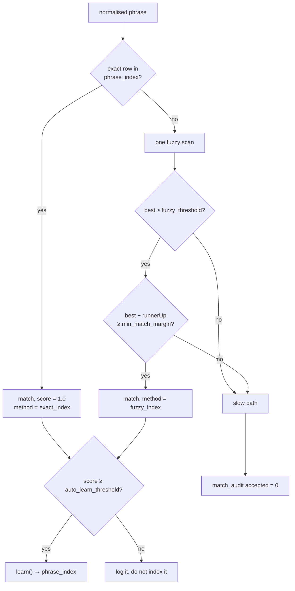

# Technical specification

The algorithms and contracts, in the order the capture path executes them.
Data model: [SCHEMA.md](SCHEMA.md). Structure: [ARCHITECTURE.md](ARCHITECTURE.md).

---

## 1. Stack

| Concern | Choice | Why |
|---|---|---|
| Shell | Mobile PWA, plain TypeScript, no framework | Time to first real log. Installs to a phone with no store listing |
| Speech | Web Speech API (`en-IN`) | On-device where the browser supports it. Swappable — the core takes a string |
| Database | SQLite → WASM (`@sqlite.org/sqlite-wasm`) | Real SQL, real constraints, in the browser |
| Persistence | OPFS via `opfs-sahpool` VFS | Durable, and needs **no COOP/COEP headers** — runs on any static host |
| Build | Vite 6 | — |
| Tests | Vitest + `node:sqlite`; Playwright for browser tiers | Core logic testable without a browser |

Node ≥ 22 (`node:sqlite`). Fallback if Web Speech latency proves
unacceptable on Android: React Native + Expo with on-device recognition —
only `src/app/speech.ts` would change.

---

## 2. Parsing — `src/core/parse.ts`

Deterministic, local, **no model call ever on this path**. When unsure it
returns *less*, never a guess: a null quantity is a gap the log can carry;
a wrong quantity is not.

### Pipeline

```
lowercase
  → rewrite spoken fractions      "one and a half" → "1.5"
  → split into items              , ; and with plus also
  → per item: quantity → unit → food phrase
  → normalise the phrase
```

Fractions are rewritten **before** splitting. Otherwise *"one and a half
rotis"* splits on `and` into `"one"` and `"a half rotis"`, silently losing
the integer part.

### Quantity

Digits first (`2`, `2.5`), then number words `zero`–`twenty`, plus
`half` = 0.5, `quarter` = 0.25, and `a`/`an` = 1 (only when something
follows).

### Unit

Matched longest-spelling-first so `grams` is not shadowed by `g`; patterns
are compiled once at module load, not per chunk. `\b` anchoring means
`ghee` is not `g + hee` and `cupcake` is not `cup + cake`.

`kg` and `l` are folded into the stored base units (`×1000` → `g`/`ml`)
so nothing downstream knows they exist.

**Quantity-gated units.** `no`/`nos` means *pieces* in Indian usage
("2 no idli") but is also the commonest negation in English. It is only
honoured when a number was already parsed, so *"no sugar"* never becomes a
piece of sugar.

### Refusing to parse

A unit with **no food after it** returns nothing: *"two katoris"* of what?
That is ambiguity, and ambiguity never reaches the log.

### Normalisation — `normalise()`

Lowercase → strip punctuation to spaces → collapse whitespace →
singularise each word. **Stability matters more than correctness here**:
the same spoken food must land on the same key every time, because a
wandering key is a wandering bias.

`singularise()` is deliberately conservative — over-stemming collapses two
real foods into one key, which is a silent false positive; under-stemming
costs one fuzzy match, which is free.

| Rule | Example |
|---|---|
| ≤3 chars, or on the never-strip list | `dal`, `rice`, `hummus`, `oats` |
| `-ss` / `-us` never stripped | `couscous`, `grass` |
| `-ies` → `-y` | `berries` → `berry` |
| `-ches/-shes/-xes/-zes` → drop `es` | `sandwiches` → `sandwich` |
| `-oes` → drop `es` | `tomatoes` → `tomato` |
| trailing `-s` | `rotis` → `roti` |

> A `/is$/` guard intended for *basis* once ate exactly the plurals that
> matter most — `rotis`, `idlis`, `puris`. Those singulars are now an
> explicit list instead of a rule.

---

## 3. Similarity — `src/core/similarity.ts`

A port of Python `difflib.SequenceMatcher.ratio()`:
`2 × matched / (len(a) + len(b))`, using the same recursive
longest-matching-block algorithm and the same tie-breaking.

It is a port rather than a fresh metric **because the thresholds in the
brief were reasoned about against that function**; swapping in a
differently-scaled metric would silently re-tune them.

`bestMatch()` returns the winner **and the runner-up it beat**. The margin
is the part that matters: a 0.90 that beat a 0.89 is a coin flip wearing a
confident number.

Currently a full scan over `phrase_index` — fine at a few hundred phrases.
`bestMatch()` is the interface to preserve when swapping in `rapidfuzz` or
a local embedding index.

---

## 4. Matching — `matchItem()` in `src/core/resolve.ts`



**One scan serves both the decision and the audit row**, so a slow-path
miss costs exactly the same lookup as a fuzzy hit.

### The asymmetry that sets the thresholds

- A **false negative** sends you to the slow path — annoying, and
  self-correcting.
- A **false positive** silently logs the wrong food, and you will never
  catch it.

Start conservative; loosen only from `v_match_review` data, not from
vibes.

### Why `auto_learn_threshold` is separate

Writing a fuzzy hit back to the index makes it an **exact** match at score
1.0 forever after. A marginal match is good enough to log once — where you
can still see it in the day list, tagged with its score — but not good
enough to compound. Set `auto_learn_threshold` equal to `fuzzy_threshold`
to get the reference behaviour.

Manual and slow-path resolutions always learn: the user said so.

---

## 5. Grams — `toGrams()`

```
unit.is_absolute        → quantity, unchanged
else user_measure       → quantity × grams
  precedence: food-specific first, then general, then most recent
else                    → null   (entry waits; nothing is invented)
```

Precedence in SQL: `ORDER BY food_id IS NULL, calibrated_at DESC LIMIT 1`.

---

## 6. Writing — `writeEntry()`

`status = 'resolved'` **iff** quantity, unit and grams are all present;
otherwise `pending_quantity` with a reason:

| Reason | Meaning |
|---|---|
| `quantity_missing` | food known, no amount said |
| `unit_missing` | amount said, no unit and no index default |
| `unit_uncalibrated` | food *and* amount known; that measure has never been weighed |

The `CHECK` constraint enforces the first sentence at the database level,
so an incomplete "resolved" row cannot exist even if the code is wrong.

---

## 7. Revisions — `revise()`, `recalibrate()`

Field whitelist: `quantity`, `unit_id`, `food_id`, `eaten_at`, `meal_slot`
(the field name reaches SQL as an identifier, so it is never taken from
caller input unchecked).

Order of operations inside one transaction:

1. write the `log_revision` row (old → new, with a reason)
2. **drop the row to `pending_quantity` and null the grams**
3. apply the field change
4. re-derive grams and status

Step 2 exists because the `CHECK` is evaluated per statement: clearing a
quantity on a row still marked `resolved` trips the constraint mid-edit
even though the end state is legal.

`match_method` is rewritten to `manual` **only** when `food_id` changes —
supplying an amount does not un-match a food, and `fastpath_fraction`
depends on that distinction.

`recalibrate()` upserts the measure, then re-derives every affected entry,
writing **one revision per entry** with reason `recalibration`. The
NULL-`food_id` case needs its own conflict target
(`ON CONFLICT(unit_id) WHERE food_id IS NULL`) — see SCHEMA §3.

---

## 8. Undo — `undoUtterance()`

Within `undo_window_ms` (default 5000):

1. decrement `hit_count` for phrases *this utterance* taught; delete the
   index row if it drops to zero
2. delete the derived `log_entry` rows
3. insert `undone_utterance`, and set `processed_at`

**The utterance itself is never deleted.** It stays true that you said it.
This keeps the one-outcome-per-utterance invariant intact and keeps undone
utterances out of the lost-logs queue.

---

## 9. Orchestration — `handleUtterance()`

```
capture()                       ← outside the transaction; cannot be rolled back
tx:
  for each parsed item:
    matchItem()
      → matched: writeEntry(), maybe learn(), audit(accepted=1)
      → missed:  audit(accepted=0)          ← nothing written to log_entry
set processed_at  ⟺  items.length > 0 AND every item produced an entry
```

That last line is the "zero logs lost" invariant. Anything else leaves
`processed_at` NULL so the utterance stays visible in `v_orphan_utterance`.

---

## 10. Timing — `src/core/timing.ts`

Marks are taken on the **absolute** clock
(`performance.timeOrigin + performance.now()`) so main-thread and worker
values are comparable.

```
mic_tap_to_stt   = sttReturned      − micTap
stt_to_capture   = utteranceCommit  − sttReturned
capture_to_entry = entriesCommit    − utteranceCommit
total_ms         = entriesCommit    − micTap
```

`total_ms` starts at the **mic tap**, not at the transcript, because the
hypothesis is about the whole gesture — not the part this code controls.
Diagnostics reports median and p90 over fast-path logs only, since
criterion 1 is about a *known repeat meal*.

---

## 11. Daily statistics — `src/core/stats.ts`

Recomputed nightly (and on app foreground). Idempotent per day.

| Field | Computation |
|---|---|
| `fastpath_fraction` | `exact_index` entries ÷ all entries that day |
| `weighed_fraction` | resolved entries whose **resolving** measure was `weighed`, or whose unit is absolute, ÷ resolved entries |
| `outside_food_count` | entries whose food has a `brand` |
| `model_eligible` | `entry_count > 0 AND pending_count = 0` |

> `weighed_fraction` uses a correlated subquery mirroring `toGrams()`
> precedence, not a `LEFT JOIN`. A join fans out when a unit has both a
> general and a food-specific calibration, counting one entry twice in both
> numerator and denominator.

**Streak** (`loggingStreak`) counts consecutive **local** calendar days
with any utterance, walking backwards; today not yet logged does not break
a live streak.

---

## 12. Meal slots — `src/core/mealslot.ts`

Windows are derived, never hard-coded.

**Exact 1-D clustering by dynamic programming** (the Ckmeans.1d.dp
formulation): the partition into *k* contiguous groups minimising total
within-group sum of squares. Prefix sums make any run's cost O(1); the
whole thing is O(k·n²), trivial at this size.

> k-means was the obvious choice and the wrong one. Seeded by quantile it
> places two centres inside whichever occasion you log most and none near
> the one you log least — so a real 17:00 snack vanished into lunch while
> dinner was split in half. In one dimension the exact answer is cheap,
> and *"same data, same windows, every time"* is not negotiable in an app
> whose thesis is consistency.

Afterwards, adjacent clusters whose means are closer than
`MIN_SLOT_SEPARATION_MIN` (90) are merged — two logs twenty minutes apart
are one eating occasion. Clusters are then named **by time order**, not by
size: the earliest is breakfast whether or not it is the one you log most.
Fewer than four clusters means fewer than four real eating times, and only
those are named.

`slotFor()` picks the nearest centre, treating the day as a **circle** so a
23:40 log is still dinner. It returns `null` when nothing has been derived:
a null slot is honest, a guessed one is not.

---

## 13. Imports

### Healthify — `src/core/healthify.ts`
Loose header matching (their export columns vary), `dd/mm/yyyy` and
`yyyy-mm-dd`, 12- and 24-hour times. Nutrient columns are **detected in
order to be dropped**, and the dropped list is reported back so you can see
it happened.

Malformed dates are **skipped, not guessed**: a wrong timestamp lands the
meal on the wrong day, and day boundaries are model input.

`phraseCandidates()` ranks phrases by frequency and marks which are already
known. It **suggests**; it never binds. Attaching a name from someone
else's database to a food is a food-identity decision.

### Garmin — `src/core/garmin.ts`
File import, not an API. The obstacle is architectural, not technical:
Garmin's developer programme needs an OAuth **client secret** and a
**webhook endpoint** to push to. A static site can hold neither — anything
shipped to a browser is public, and there is nowhere for a push to land.
Connecting directly means running a server that holds a Garmin token and
sees health data in transit, which spends the local-first property for a
convenience on data that arrives once a day.

Handles both export shapes, detected from headers rather than by asking:
activity exports become `workout_session` + a **Garmin-sourced**
`session_energy` row; wellness reports become `daily_metric` rows.

Three things the parser gets right that are easy to get wrong:

- **A two-part duration is genuinely ambiguous.** `"45:12"` of activity
  time is 45 min 12 s; `"7:24"` of sleep is 7 h 24 min — identical
  formatting, 60× apart. The *caller* states which column it is reading;
  the parser never guesses, because a sleep figure 60× too small is
  entirely plausible to a model.
- **`--` and blank are missing, never zero.** A day the watch spent on the
  charger is not a zero-step day.
- **Longest alias first**, so `sleep` does not swallow `deep sleep` and
  `rem sleep`.

Malformed dates are skipped and reported. Import is idempotent on
`(started_at, kind)` and `(log_date, metric, source)`.

`sourceCoverage()` reads `v_source_coverage`: when each source starts and
stops, so a regime change is visible rather than latent.

### Food data — `src/core/foodimport.ts`
Any CSV with a name column and ≥1 recognised nutrient column. Aliases map
to canonical keys; unrecognised columns are reported, not guessed.

- A **blank cell is missing data, not zero** — writing 0 invents a
  measurement.
- A row with no energy value is skipped and named in the report.
- Loading is idempotent: same file twice updates rather than duplicates.
- The same food from two sources stays two rows, each with its own
  provenance.

`rel_error` by source: `0.10` database, **`0.22` label**, `0.25`
user-defined.

---

## 13b. Energy targets — `src/core/energy.ts`

Owner-authorised. BMR from the published equations (Mifflin-St Jeor,
revised Harris-Benedict, Katch-McArdle — the last skipped without a
measured body-fat figure rather than run on a guess), scaled by an
activity factor, shifted by the goal rate at **7000 kcal/kg**.

Two constants here are *calculator.net's*, not the classical ones, and a
test pins all seven of that site's published figures so they cannot
drift: the "moderate" multiplier is **1.465** (not the Harris-Benedict
1.55), and 1 kg/week maps to exactly 1000 kcal/day.

Targets follow the `session_energy` pattern — one `energy_target` row per
source, none averaged — with precedence deliberately inverted:
measurements let the best instrument win; decisions let the user win
(`manual` → `cycled` → `adaptive` → formulas). `saveProfile()` rejects
non-finite numbers at the boundary (a NaN weight would silently poison
every future target) but does not police ranges: the user's number is the
number. A formula whose BMR goes non-positive on far-out-of-population
inputs emits nothing rather than a negative target.

Macro budgets use Atwater factors over an editable split; a split that
does not sum to 100 is **reported, not repaired**. Fibre scales at
14 g/1000 kcal. `weightProgress()` reads start and current weight off the
append-only profile history rather than keeping a separate start field
that would eventually disagree with it.

## 13c. Calorie cycling — `src/core/cycling.ts`

Redistributes `dailyTarget × 7` across the week using training load
(`v_session_energy`) and the watch's sleep, HRV and stress
(`v_daily_metric`) against the user's **own 28-day rolling baselines**.

A transparent weighted sum, not a model: each day carries a sentence
naming which input moved it and by how much, so a suggestion can be
argued with. Signal directions — training up → eat more; short sleep,
suppressed HRV, high stress → ease the deficit — are stated as tests so
they cannot drift. A missing metric contributes *nothing*: a watch on the
charger is not an average night.

Invariants, all asserted: the weekly total is conserved to rounding
(clamp to ±`max_cycle_swing`, redistribute the remainder among unclamped
days until it settles); the safety floor is the one thing allowed to
raise the total, and the caller is told; `maxSwing: 0` reduces to a flat
week; `clearPlan()` removes **today forward only**, because what the
target was on a logged day is part of that day's record.

Honest limits: that training days need more fuel is uncontroversial; that
HRV and sleep should modulate intake is plausible and widely practised
but **not established** to beat a flat deficit — hence gentle weights, a
cap, and an off switch.

## 14. Totals and error propagation

`v_daily_totals` sums only `status = 'resolved'` rows and combines errors
**in quadrature**, not linearly:

```
total     = Σ (grams/100 × per_100g)
abs_error = √( Σ (grams/100 × per_100g × rel_error)² )
```

Independent errors partially cancel; adding them linearly would overstate
the band. Requires SQLite built with math functions — present in both
`node:sqlite` and the official WASM build.

---

## 15. Persistence and the worker

`openDatabase()` installs the `opfs-sahpool` VFS and opens
`nutrition.sqlite3`. If OPFS is unavailable (private window, unsupported
browser) it falls back to an **in-memory** database — the app still works,
and Diagnostics states plainly that nothing is being saved rather than
letting the user discover it after a week.

The `Db` interface is synchronous in both implementations. Transactions
nest via savepoints, so `tx()` inside `tx()` joins the outer one.

`initSchema()` applies `schema.sql` once, then `seed.sql` on **every**
open — seed is idempotent and carries additive migrations, so an existing
database picks up new indexes without a migration runner.

---

## 16. Security posture

There is no server, no account and no third-party request; the realistic
threat is a future code change that leaks a database full of health data.

| Control | Where |
|---|---|
| CSP, no inline script or style | build-time `<meta>` (host-independent) **and** a real header in `render.yaml` — kept byte-identical |
| No HTML injection sinks | UI builds DOM nodes; no `innerHTML`/`eval` anywhere |
| Parameterised SQL | every query; identifiers come from a whitelist, never from input |
| `LIKE` wildcards escaped | food search, so `100_ juice` is literal |
| Path traversal guard | the test static server normalises then re-checks the root |
| `X-Frame-Options: DENY`, `nosniff`, `no-referrer`, restrictive `Permissions-Policy` | `render.yaml` |
| `sw.js` `no-cache` | a cached service worker can never update itself again |
| Dependencies | `npm audit` clean |

---

## 17. Performance notes

- **One fuzzy scan per item**, reused for the audit row.
- **Unit regexes compiled once** at module load, not ~40 per chunk.
- **One `postMessage` per user action**, returning a whole snapshot.
- `/assets/*` are content-hashed and served `immutable`.
- Main bundle ~23 kB gzipped ~8.7 kB; SQLite WASM ~856 kB (~393 kB gzipped)
  loads once and is cached immutably.

Measured capture latency on the typed path (no STT) is tens of
milliseconds — the 3-second budget is spent almost entirely in speech
recognition, which is exactly what criterion 1 needs to find out.

---

## 18. Testing

| Tier | Command | What only it can cover |
|---|---|---|
| Unit | `npm test` | All of `src/core`, twice: `TZ=UTC` and `TZ=Asia/Kolkata` |
| Browser | `npm run test:browser` | sqlite-wasm, OPFS across reload, real UI, CSP, backup bytes |
| Hosted | `npm run test:hosted` | Built `dist/` on a dumb static server + service worker |

Every fix in this codebase carries a regression test; the invariants in
SCHEMA §"The invariant, as one query" are asserted directly.
